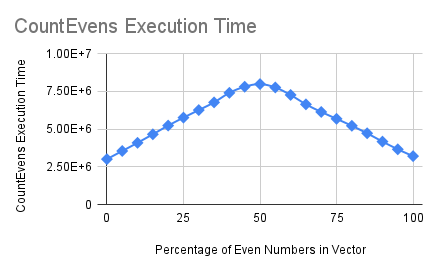

# Overview

Understanding the mechanics of branch prediction and the performance costs behind it is important for the development of high performance applications. Latency does not necessarily scale with the number of branches within code, but eliminating branches where possible usually increases performance, and the predictability of programs and the data being processed within them are a key component of success.

# Motivation

Modern computers/CPUs use a pipelining

In simple terms, branch predictors keep track of whether branches from conditional jumps are taken or not. 

An alternative way to visualise how this works is with

# Description

# Benchmark Results

| Percentage of Even Numbers in Vector | CountEvens Execution Time (ns) |
|--------------------------------------|--------------------------------|
|                                    0 |                        3003347 |
|                                    5 |                        3543721 |
|                                   10 |                        4084344 |
|                                   15 |                        4648943 |
|                                   20 |                        5227015 |
|                                   25 |                        5754339 |
|                                   30 |                        6253471 |
|                                   35 |                        6762285 |
|                                   40 |                        7395470 |
|                                   45 |                        7799465 |
|                                   50 |                        7974268 |
|                                   55 |                        7750755 |
|                                   60 |                        7254713 |
|                                   65 |                        6632476 |
|                                   70 |                        6128936 |
|                                   75 |                        5674009 |
|                                   80 |                        5212384 |
|                                   85 |                        4717636 |
|                                   90 |                        4165762 |
|                                   95 |                        3654579 |
|                                  100 |                        3202696 |