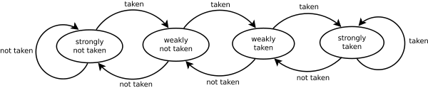
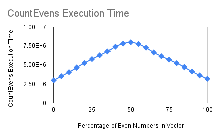

# Overview

Understanding the mechanics of branch prediction and the performance costs behind it is important for the development of high performance applications. Latency does not necessarily scale with the number of branches within code, but eliminating branches where possible can often increase performance, and the predictability of programs and the data being processed within them are a key component of success.

# Motivation

Modern computers/CPUs use a pipelined architecture where instructions are processed in parallel (instruction-level parallelism) by passing them through different stages. An example of a five-stage pipeline (RISC) would have the following stages:

- Fetch
- Decode
- Execute
- Memory Access
- Writeback

However, this method of processing instructions comes with potential pitfalls in the form of pipeline hazards, which can lead to incorrect computations or delays in processing. Pipeline hazards are defined under certain classes; one class of hazards are "control hazards", caused by both conditional and unconditional branches (jumps).

Branches instructions are implementations of control flow in loops (for-loops, while-loops, etc.) and conditionals (if statements, switch statements) that cause computers to execute a different sequence of instructions if it is "taken". If it is "not taken" then the instruction following it is executed.

Conditional branches are a source of latency in applications because its condition must be evaluated and the conditional branch instruction must have completed the execution stage in the instruction pipeline. It is unknown whether the branch is taken until this is completed, so the correct instruction that should be executed after it is unknown. This results in a "pipeline bubble" - empty slots in the instruction pipeline because the following instruction cannot be determined.

# Description

There are different schemes to solve the performance issues with branches at the hardware level. Branch predictors are one such solution which keep track of whether branches from conditional jumps are taken or not. These are digital circuits that attempt to improve the performance of the instruction pipeline and minimise control hazards. By "predicting" whether a branch is taken or not, instructions can be speculatively processed within the pipeline, keeping it full and minimising delays. Making an incorrect decision (otherwise known as a branch misprediction) results in the following instructions in the pipeline to be flushed, as they were processed prematurely.

One method of branch prediction is to use a state machine with four states, as shown below:



Evaluated branches update their corresponding state machine by moving its state closer towards the "strongly not taken" and "strongly taken" states based on the result of the conditional branch.

Another implementation of a branch predictor uses a "pattern history table", with its entries being two-bit counters. The advantage is that it can spot recurring patterns, which would not be picked up by the earlier example of the 4-state state machine. The branch predictor can then preemptively process the instructions that should follow the branch.

With this understanding of branch predictors and how they operate, the penalties that can come with branches can be mitigated in a number of ways. One way is to use "predictable" data, i.e. data that will cause branches to mostly be either taken or not, which assists the branch predictor in making the correct decision for which instructions should be fetched. The next section demonstrates how the randomness of data being processed affects the execution speed of programs, therefore increasing the latency within the application.

# Benchmark Results

Consider the following function, which returns the number of even numbers in a vector of integers:

```c++
static int CountEvens(std::vector<int> &nums) {

    int count = 0;

    for (int i = 0; i < nums.size(); i++) {
        if (nums[i] % 2 == 0) {
            count++;
        }
    }

    return count;
}
```

Benchmarking this function with vectors that have different proportions of even numbers yields an interesting graph of results, shown below:



| Percentage of Even Numbers in Vector | CountEvens Execution Time (ns) |
|--------------------------------------|--------------------------------|
|                                    0 |                        3003347 |
|                                    5 |                        3543721 |
|                                   10 |                        4084344 |
|                                   15 |                        4648943 |
|                                   20 |                        5227015 |
|                                   25 |                        5754339 |
|                                   30 |                        6253471 |
|                                   35 |                        6762285 |
|                                   40 |                        7395470 |
|                                   45 |                        7799465 |
|                                   50 |                        7974268 |
|                                   55 |                        7750755 |
|                                   60 |                        7254713 |
|                                   65 |                        6632476 |
|                                   70 |                        6128936 |
|                                   75 |                        5674009 |
|                                   80 |                        5212384 |
|                                   85 |                        4717636 |
|                                   90 |                        4165762 |
|                                   95 |                        3654579 |
|                                  100 |                        3202696 |

The benchmarks demonstrate how a vector with an equal number of odd and even numbers suffers the most from branch misprediction penalties, with the execution time of the function being 2.5x the duration of the function of entirely odd numbers. The conclusion that can be taken from this is that branches do not necessarily result in longer execution times, as predictable input data can mitigate the number of branch mispredictions caused.

# Related

- Predication: an example of a branch-free approach to writing programs