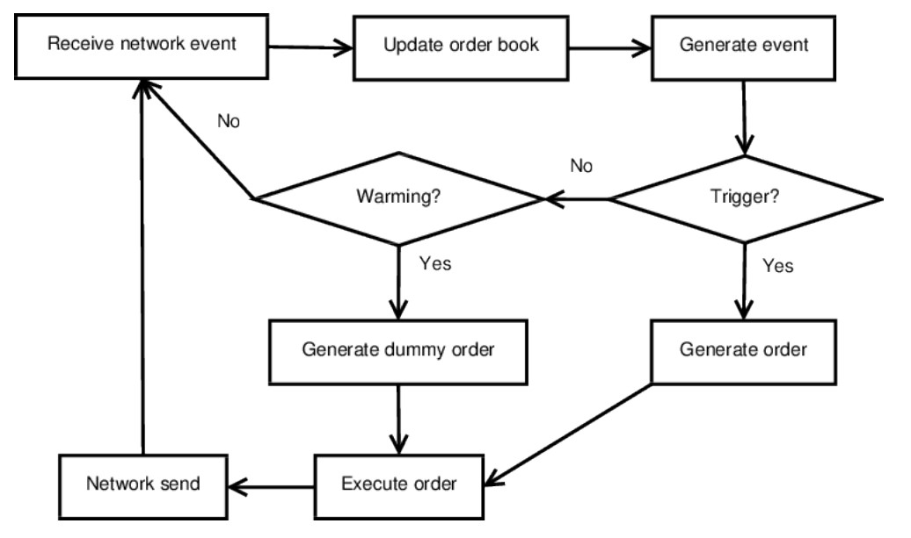

# Overview

Cache warming occurs when an application artificially moves data into the cache to ensure that it is available when needed at critical moments. This means the cache is kept "warm", and eliminates the penalties incurred from cache misses.

# Motivation

In some scenarios the low-latency sections of code might be the least frequently executed part of the application, which leads to potential issues with how it is stored in memory. After a certain amount of time, function blocks and their corresponding data will be removed from the instruction and data cache. This will result in cache miss penalties which may significantly harm the performance of the application.

# Description

Cache Warming is the technique of executing the critical sections of code periodically to ensure that it is stored in the cache (as well as any related data). However, there is a possibility that the application does not want the function to carry out all its actions, so it is important to set this up in a way that prevents any unwanted actions from executing. 

A relevant example is a high-frequency trading platform that continuously reads market data and sends out buy orders at a relatively lower rate. The buy orders must be executed quickly to reach the exchange as fast as possible, and cache misses will severely hamper the application's capability to do so. 

The diagram above shows the decision tree of such a scenario. A network event is received, causing the application to update its order book and generate an event. Most of the time, nothing will be triggered, and it will continue polling/waiting for a network event to occur again.

The problem occurs when the event is in fact triggered. An order is generated, executed, and sent via the network. However, the instructions are unlikely to be stored within the instruction cache because of the lengthy interval without calling that code.

To solve this issue, we can implement the solution illustrated in the diagram below.

After an event is generated, choosing not to trigger it will lead to a second decision, determining whether warming is necessary. If so (perhaps after a certain amount of time has elapsed), a dummy order is generated and executed, keeping the performance-critical segments of code within the cache and circumventing avoidable cache miss penalties.
