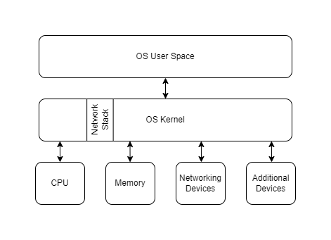
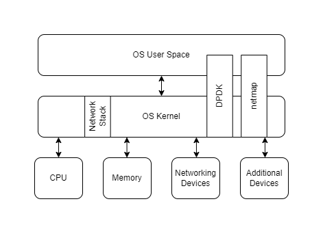

# Overview

Kernels provide a layer of abstraction between the applications in a computer and the hardware that they are running. This abstraction results in limitations among applications, which cannot fully utilise the capabilities of the underlying hardware. Bypassing the kernel is a concept where processing is moved from the kernel to the user space.

This section focuses specifically on networking, where the difference in capabilities between the kernel and the hardware is at its greatest.

# Motivation

The basic Linux kernel is limited in its performance, and prevents applications from properly utilising the hardware available in the computer. The diagram below shows how the kernel sits between the applications in the userspace and the hardware. Within the kernel is the network stack, which implements protocols up to the transport layer (application layer protocols such as HTTP or FTP are typically implemented in the userspace).

This level of abstraction has performance consequences, with overheads that are widely known and documented (e.g. [Fast programmable packet processing in the operating system kernel, Høiland-Jørgensen](https://dl.acm.org/doi/10.1145/3281411.3281443)). POSIX sockets are the current standard interface for programming within networking, and most in-kernel network stacks implement socket operations as systems calls. These have substantial overheads (e.g. context switches), and they do not take advantage of multicore CPU architectures. Furthermore, the socket API forces the operating system to use dynamic memory allocation when handling packets by wrapping it in a buffer object, which puts pressure on the OS.

The kernel can only process about 1 million packets per second, whilst modern 10Gbps Network Interface Cards (NICs) can often process 10 million per second, and higher-end NICs hitting over 200 Gigabit Ethernet (GbE) cards are being produced. A 200GbE card can deliver packets with as low as 61 nanoseconds between them. This means there is much less time available to process packets without a significant backlog. Clearly, the current design of the kernel cannot keep up with the capabilities of networking hardware.

# Description

One approach to overcoming the setbacks of the kernel is to bypass it altogether. Moving the processing of protocols to the userspace allows programmers to avoid the overheads of system calls and OS abstractions. Ethernet connections have a couple of solutions:

1. Assign NICs to applications, allowing them to be programmed. The Data Plane Development Kit (DPDK) is an example of this.
2. Mapping NIC queues to the OS's address space. The "netmap" project is a framework that does this, achieving high speed packet I/O.

The following diagram illustrates these solutions within the computer architecture, which span from the userspace directly to the hardware.

Both of these approaches allow the packets to be processed within the userspace with minimal overhead induced by the operating system. This allows high-end NICs to be utilised properly without being bottlenecked by the kernel, shifting the responsibility of high performance applications to the abilities of the programmer/engineer. Additional responsibilities are now present within the userspace in its method of handling incoming packets. These must be decoded and interfaces will need to be provided to successfully manage their messages.