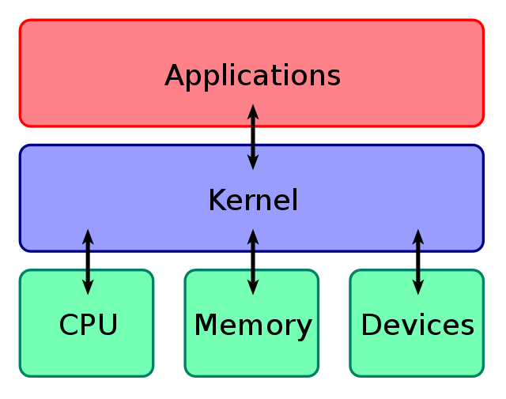

# Overview

Kernels provide a layer of abstraction between the applications in a computer and the hardware that they are running. This abstraction results in limitations among applications, which cannot fully utilise the capabilities of the underlying hardware. Bypassing the kernel is a concept where processing is moved from the kernel to the user-space.

This section focuses specifically on networking, where the difference in performance between the kernel and the hardware is at its greatest.

# Motivation

The basic Linux kernel is limited in its performance, and prevents applications from properly utilising the hardware available in the computer. The diagram below shows how the kernel sits between the applications and the hardware. 

This level of abstraction has performance consequences, with overheads that are widely known and documented (e.g. [Fast programmable packet processing in the operating system kernel, Høiland-Jørgensen](https://dl.acm.org/doi/10.1145/3281411.3281443)).

The kernel can only process about 1 million packets per second, whilst modern 10Gbps Network Interface Cards (NICs) can often process 10 million per second, and higher-end NICs hitting over 200 Gigabit Ethernet (GbE) cards are being produced. A 200GbE card can deliver packets with as low as 61 nanoseconds between them. This means there is much less time available to process packets without a significant backlog. Clearly, the design of the in-kernel network stack cannot keep up with the capabilities of the hardware.

# Description

One option is to use a kernel that is designed for low-latency applications. For example, Ubuntu suggests that the programmer uses its low-latency kernel when using applications that require the additional speed (e.g. audio applications), which contains optimisations to achieve better performance. Ubuntu claims that latency as low as 0.1 milliseconds has previously been achieved using this kernel.

Another alternative is to bypass the kernel altogether. Taking the earlier example of NICs, OpenOnload is a high-performance application accelerator developed by SolarFlare that allows their network cards to be accessed directly via a kernel bypass, giving the programmer more predictable latency . Another alternative is the Data Plane Development Kit (DPDK), which is also a popular kernel bypass solution that avoids the standard interrupt processing used in the kernel.