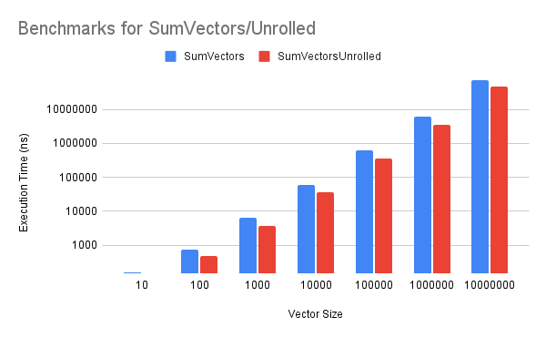

# Overview

Loop unrolling is a loop transformation technique that minimises loop overhead by repeating independent statements sequentially within the loop. The reduced number of iterations increases the potential for improved performance, and may even result in better instruction pipelining.

Loop unrolling can be carried out at compile time with an optimising compiler, or can be performed manually by the programmer.

# Motivation

Program bottlenecks can come from the execution of loops, which have overhead associated with them because of the branch penalty incurred on each iteration, also known as "loop overhead".

The example below shows a function that takes two `int` vectors, `x` and `y`, of (presumably) equal `size`. It adds the elements together per-index and stores the result in a third array, `z`, which is returned.

```c++
static vector<int> SumVectors(const vector<int>& x, const vector<int>& y, int size) {
    vector<int> z;
    z.reserve(size);
    for (auto i = 0; i < size; i++) {
        z[i] = x[i] + y[i];
    }
    return z;
}
```

After each summation, the index of the loop `i` is compared to the `size` of the vectors, resulting in a branch and incurring loop overhead. In this particular example, the code branches `size` times.

How can the programmer (and compiler) exploit the sequential access of the vectors to reduce the number of branches per iteration?

# Description

Manual loop unrolling is performed by refactoring a loop's iterations into a sequence of instructions. A sequence of statements can be repeated `n` times, as long as the size of the loop is divisible by `n`. `n` is otherwise known as the "loop unrolling factor".

The example used earlier can be rewritten as follows, with a loop unrolling factor of 2:

```c++
static vector<int> SumVectorsUnrolled(const vector<int>& x, const vector<int>& y, int size) {
    vector<int> z;
    z.reserve(size);
    for (auto i = 0; i < size / 2; i += 2) {
        z[i] = x[i] + y[i];
        z[i+1] = x[i+1] + y[i+1];
    }
    return z;
};
```

The structure of the loop has been changed so that `i` is incremented by 2 instead of 1, and two summations are performed on each iteration instead. Therefore, only `size`/2 branches are incurred, reducing the overall loop overhead.

This example is simple because of the assumed precondition that `size` is divisible by 2. Without this guarantee, another check may need to be performed (i.e. `size` is odd) to perform a final iteration of the loop after the main loop shown above.

As with many other optimisations (see inlining), loop unrolling is a space-time tradeoff, but excessively using the technique may actually degrade performance. Naturally, larger loop unrolling factors can be used to reduce the number of branches, but the larger blocks of code may cause thrashing if the program code doesn't fit into the instruction cache. The programmer must carefully tune the loop unrolling factor by profiling and benchmarking their code.

# Benchmark Results

| Vector Size | SumVectors Execution Time (ns) | SumVectorsUnrolled Execution Time (ns) |
|-------------|--------------------------------|----------------------------------------|
|          10 |                            159 |                                    143 |
|         100 |                            720 |                                    476 |
|        1000 |                           6233 |                                   3693 |
|       10000 |                          60547 |                                  36349 |
|      100000 |                         609585 |                                 359499 |
|     1000000 |                        6084840 |                                3581000 |
|    10000000 |                       72235795 |                               47303487 |
|    10000000 |                       32828489 |                               27445521 |



# Use cases

Loop unrolling can be beneficial to performance if executed correctly, with the danger of thrashing in mind. As a general rule (as with most hand optimisations), one should always profile and benchmark the performance before and after the optimisation to study its benefits.

The earlier code snippet is an example of "manual" loop unrolling, which is performed explicitly by the programmer. "Dynamic" loop unrolling is performed by optimising compilers, which can execute this optimisation based on the size of the array/vector being handled.

The increased binary size can be undesirable for embedded applications, but in the context of low-latency applications (which do not often have the limitation of program code size), this tradeoff is usually worthwhile.