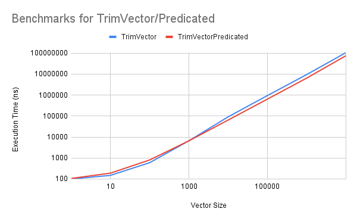

# Overview

Predication is a branch-free programming technique that avoids conditional branch instructions. Predication has non-branch instructions associated with a predicate, and a boolean value controls whether the state of the program is changed (with the state being modified if the `true` is evaluated).

# Motivation

Branches are sources of pipeline hazards that introduce latencies during runtime. The cost of a branch misprediction can be high on architectures that are deeply pipelined. This may not seem like a problem for powerful systems, but low latency applications can require every nanosecond available to gain an advantage.

Producing code that avoids branches can often be performed by modern compilers, but detecting every pattern available isn't realistic nor is it something that you would want to rely on your compiler to do. Predication is one of several techniques to produce branch-free code.

# Description

Function inlining is a good example of "partial evaluation", which turns the jumps from functions into branches, mitigating the overhead of calling the function. We can take this a step further and strive for "branch-free" code, removing the penalty of their associated control hazards altogether. 

Consider the following function, which returns a copy of a `vector<int>` excluding values above a defined threshold:

```c++
static std::vector<int> TrimVector(int max, const std::vector<int>& input, int size) {

    std::vector<int> output(size);
    int outputI = 0;

    for (auto i = 0; i < size; i++) {
        if (input[i] < max) {
            output[outputI++] = input[i];
        }
    }

    return output;
}
```

A branch is performed on each iteration of the loop, checking if the current value exceeds the threshold. This means that each iteration has the risk of a branch misprediction, which could result in a total latency penalty of a considerable size.

Consider the improved implementation of the `TrimVector` function below:

```c++
static std::vector<int> TrimVectorPredicated(int max, const std::vector<int>& input, int size) {

    std::vector<int> output(size);
    int outputI = 0;

    for (auto i = 0; i < size; i++) {
        output[outputI] = input[i];
        outputI += (input[i] < max);
    }

    return output;
}
```

This implementation exploits the evaluation of `input[i] < max` into a boolean, where `true` and `false` is equivalent to `1` and `0` respectively. This value is then added to the `outputI` variable, (used to indicate the position in the array) which eliminates the branch altogether - this technique is known as "predication".

Using a more general example, consider the following code:

```c++
if cond {
    foo();
} else {
    bar();
}
```

This could compile to instructions like so:

```
branch-if-cond-to l1
call bar
branch-to l2
l1:
call foo
l2:
.
.
.
```

Predication will instead look to eliminate the branches by having instructions associated with predicates, only being executed when the predicate is true. Ideally, the example would be compiled to this:

```
(cond) call foo
(not cond) call bar
```

Together the instructions have both function calls, but one will execute whilst the other will not.

# Benchmark Results



# Use cases

Writing branch-free code is usually non-trivial, but this technique is fairly straightforward to understand - the opportunities for improving performance comes from manipulating `if-else` and similar statements that are compiled into branches. Vector processors and GPUs heavily use predication because of the absence of branches.