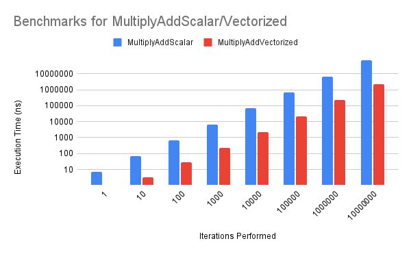

# Overview

SIMD (Single Instruction, Multiple Data) describes computers with the capability of performing a single operation on multiple data points in parallel. SIMD Instructions and their corresponding intrinsics allow the programmer to utilise the vector registers that are present in these computers/processors to obtain a substantial gain in performance and execution speed.

# Motivation

"Flynn's taxonomy" categorises the forms of parallel computer architectures, proposed in 1966 and extended in 1972. This was extended further by Ralph Duncan in 1990 with "Duncan's taxonomy", which proposed the addition of vector processing.

Scalar processors are the simplest type of processors, usually processing one item at a time, handling each instruction sequentially. These are otherwise known as SISD (single instruction single data) CPUs.

Recent developments in computing have standardised vector processors, which instead operate on arrays of data. A vector processor can perform an instruction on several data points using SIMD (single instruction multiple data) instructions, with modern SIMD instructions being introduced to Pentium processors in 1999.

# Description

Vectors are instruction operands represented as a one-dimensional array of data elements, being either integer or floating-point values. Vector registers hold these data elements as a single vector and can vary in size. Intel's AVX-512 instruction set performs vector operations on 512-bit vectors, equivalent to 16 `ints`.

Compilers attempt to auto-vectorize code, for which they are successful for simple cases like the element-wise multiplication of two vectors. However, there are cases where auto-vectorisation is unsuccessful. In most cases, the programmer must vectorize their code manually using intrinsics. Consider the following function, which multiplies the elements of two arrays containing 8 floats together and adds the values of a third array, storing it in a fourth array (`d`):

```c++
static void MultiplyAddScalar(const float* a, const float* b, const float* c, float* d) {

    for (int i = 0; i < 8; i++) {
        d[i] = a[i] * b[i] + c[i];
    }

}
```

SIMD instructions can perform the same calculation by loading the values into vector registers and performing the same calculation on them. In the following example, the arrays of `floats` have been casted to the `__m256` data type, allowing it to be loaded into an AVX register. The `_mm256_fmadd_ps` then performs the same calculation as before (`a * b + c`) and returns the result:

```c++
static __m256 MultiplyAddVectorized(__m256 a, __m256 b, __m256 c) {
    return _mm256_fmadd_ps(a, b, c);
}
```

# Benchmark Results



| Iterations Performed | MultiplyAddScalar Execution Time (ns) | MultiplyAddVectorized Execution Time (ns) |
|----------------------|---------------------------------------|-------------------------------------------|
|                    1 |                                  6.99 |                                       1.1 |
|                   10 |                                  68.6 |                                       3.3 |
|                  100 |                                   679 |                                      29.8 |
|                 1000 |                                  6793 |                                       227 |
|                10000 |                                 67856 |                                      2273 |
|               100000 |                                678666 |                                     22019 |
|              1000000 |                               6845885 |                                    218869 |
|             10000000 |                              69030639 |                                   2186023 |

There was a clear disparity between the speed of the calculation performed when using classical operations against vectorised operations with the `MultiplyAdd` function, with almost a 70% performance increase when the operations were repeated a significant number of times.

It is worth noting that the movement of the data in the array to the vector registers were not accounted for, so the performance impact suggested by the numbers may be slightly overstated. However, real-world applications will often perform multiple operations on the vector registers before unloading the values, so the overhead from loading/unloading will be less significant.

# Use cases

The usefulness of SIMD instructions/operations are almost universal, and are widely utilised for applications for 3D graphics or audio/video processing. The following list describes applications that benefit from vectorisation significantly:

## 3-Dimensional Processing

There is significant potential for parallelism when working with 3D vertices and their transformations, which applications can exploit by using SIMD instructions to increase performance. This allows more objects to be rendered in scenes, and opens up the possibility of shadows and reflections to be rendered in real-time.

## Image Processing

The parallelism in both the code and data structures of imaging software allows SIMD instructions to improve the performance of the application. The increased performance enables users to maintain interactivity even as the image size increases greatly, and should result in gains of the speed of image transformations and manipulations.

## Video Processing

Considering that videos are streams of images shown to an end user, the benefits of image processing described in the previous section also apply to video processing, which typically are even more demanding performance-wise. SIMDs provide the potential for video transformations to be performed in real-time, which requires a huge amount of optimisation considering the performance challenges that are already present in image processing.